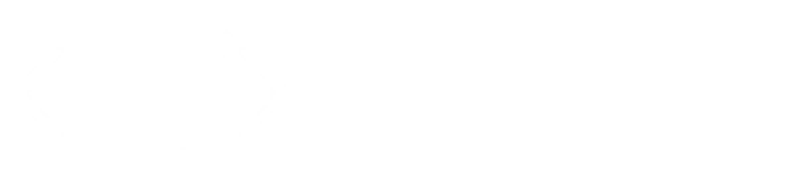

    
    <h2>
        A roulette game for programming project challenges
    </h2>

 
 

# Welcome
Projlette is a programming game that you can play alone or with your friends!
Randomly generate different challenges and solve the problems to the very best of your ability.
The goal is to evolve your programming skills and become a better programmer, as well as having fun!

### Play the game on [projlette.com](http://projlette.com)!

## Development

The back-end is written in TypeScript running on Deno using the https://deno.land/x/knight framework. The front-end is running a React app on Node + TypeScript built with https://bulma.io/ and https://fontawesome.com/v5/icons.
